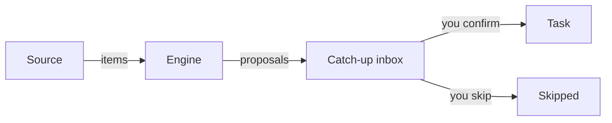

# Concepts

Three words are used consistently across the UI, the API and the code. They never mix.

## Item, Task, Bucket

Item

:   One thing from one source: a PR, a Slack thread, a todo line, a branch. An item can attach to
    several tasks — a chat thread that argues two subjects is about both, and making it pick one
    loses information.

Task

:   A subject you handle. Items attach to it. Tasks are **yours** — created by hand or by
    promoting an item in [catch-up](screens/catch-up.md). A sync never invents one.

Bucket

:   A topic column on the [board](screens/board.md), grouping tasks. Buckets are user-defined: HQ
    can't know what you work on, so **no buckets ship by default**. A task matching no bucket
    falls to **Uncategorized**, which is implicit and has no settings of its own.

It reads as **Bucket → Task → Item**.

## Sources never create tasks

A [source](sources.md) adapter emits items and nothing else. It declares its own config fields,
which is what lets the [Admin](screens/admin.md) panel render a setup form for a source it has
never heard of. A source with no credentials reports itself unconfigured and returns nothing — it
never fails the sync.

## The engine proposes; you decide

Every incoming item goes through the engine, which returns **proposals** — a task, a confidence
and a reason. Grouping is global: the engine sees every task, not just those from the item's
source, so a Slack thread can join a task first built from a GitHub PR.

Two deterministic engines run, and the **single strongest** proposal per task wins — corroboration
doesn't compound:

- **Key engine** — matches the ticket references an item and a task share. If both *name* the same
  ticket (e.g. a PR and a Linear issue both about `ENG-42`), it proposes at **100%**; if the item
  merely *cites* a key the task already owns, **90%**. A written ticket reference is a deliberate
  act, so it's the only engine trusted at high confidence.
- **Title similarity** — a fuzzy match of normalised titles (conventional-commit prefixes like
  `feat(scope):` and branch-owner prefixes stripped), from a 75% threshold and **capped at 80%**,
  so a lookalike title can never beat a real key match.

Not every source uses both: **Slack** and **Dust** are key-only (chat text fuzzy-matched against
titles is confident nonsense), and **todos** are title-only. The optional [AI brain](brain.md) can
propose a third kind of match on demand.

## A Link carries the decision

An item attaches to a task through a **Link**, whose state records who decided:

| State | Meaning |
| --- | --- |
| **proposed** | an engine's guess. **Rebuilt from scratch on every sync**, so an engine may change its mind. Shows on the board and lands in catch-up. |
| **confirmed** | you said yes. A sync never touches it. |
| **rejected** | you said no. Kept as a row, so an engine can't re-propose a dismissed link. |

This is why a filed item **stays filed**: a source dropping it — a merged PR leaving GitHub's open
search, a deleted branch — can't remove your decision. And **new activity on an item you've already
attached won't drag it back to the inbox**; only items you haven't filed resurface when they move.
(An item is only *deleted* on a sync if it's unattached *and* the source stopped returning it.)

## Catch-up

The [catch-up inbox](screens/catch-up.md) is every item you haven't ruled on. **Triage rules**
auto-skip noise before it piles up; **Match all** drains the inbox by asking the [brain](brain.md)
where each item belongs; skipped items stay one tab away and return to the inbox if you un-skip
them.
