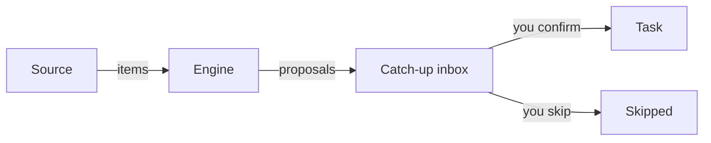

# Concepts

Three words are used consistently across the UI, the API and the code. They never mix.

## Item, Task, Bucket

Item

:   One thing from one source: a PR, a Slack thread, a todo line, a branch. An item can attach
    to several tasks — a chat thread that argues two subjects is about both, and making it pick
    one loses information.

Task

:   A subject you handle. Items attach to it. Tasks are **yours** — created by hand or by
    promoting an item in catch-up. A sync never invents one.

Bucket

:   A topic column on the board, grouping tasks. Buckets are user-defined: HQ can't know what
    you work on, and a wrong guess fills the board with a taxonomy that isn't yours. A task
    matching no bucket falls to **Uncategorized**.

It reads as **Bucket → Task → Item**.

## Sources never create tasks

A source adapter emits items and nothing else. It declares its own config fields, which is what
lets the Admin panel render a setup form for a source it has never heard of.

## The engine proposes; you decide

Every incoming item goes through the engine, which returns **proposals** — a task, a confidence
and a reason. Grouping is global: the engine sees every task, not just those from the item's
source, so a Slack thread can join a task first built from a GitHub PR.

## A Link carries the decision

An item attaches to a task through a **Link**, whose state records who decided:

- **proposed** — an engine's guess. Rebuilt on every sync, so an engine may change its mind.
- **confirmed** — you said yes. A sync never touches it.
- **rejected** — you said no. Kept as a row, so an engine can't re-propose a dismissed link.

This is why an item you've filed stays filed: a source dropping it — a merged PR leaving
GitHub's open search, a deleted branch — can't remove your decision, and new activity on it
won't drag it back to the inbox.

## Catch-up

The catch-up inbox is everything you haven't ruled on. **Triage rules** auto-skip noise before
it piles up; **Match all** drains the inbox by asking the engine (and the AI brain) where each
item belongs; skipped items stay one tab away.
