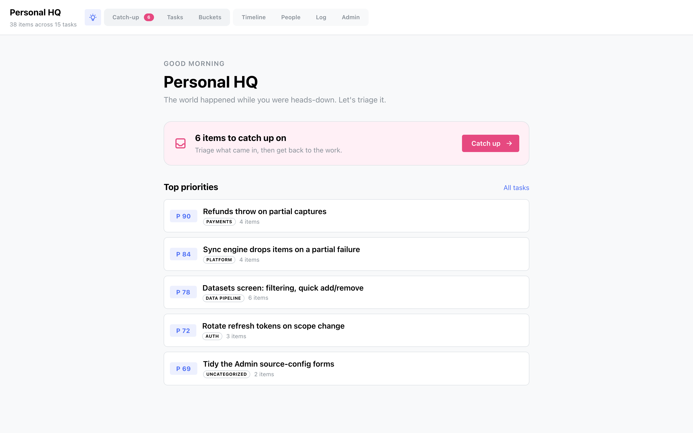

# Getting started

Personal HQ is a local web app: a FastAPI backend and a React frontend, run side by side.

## Requirements

Tooling comes from [devbox](https://www.jetify.com/devbox), so you don't install Python, Node
or anything else by hand:

- [devbox](https://www.jetify.com/devbox) (and [direnv](https://direnv.net/), optional but
  recommended)

Everything else — Python, uv, Node, yarn, [go-task](https://taskfile.dev), Caddy — is pinned in
`devbox.json`.

## Install and run

```bash
devbox shell          # or let direnv load the environment
task setup            # install backend + frontend, create and migrate the database
task dev              # API on :13000, UI on :13001
```

Open the UI, head to **Admin**, and connect a source or two. HQ **degrades gracefully**: a
source with no credentials simply reports itself unconfigured — it never fails the sync.

## Try it with demo data

You don't need to connect anything to see how HQ looks. Build a seeded, throwaway database and
run the app against it:

```bash
task back:seed        # builds backend/hq-demo.db across every source
task front:build      # so the API can serve the built UI
task back:demo        # serves the whole app on :13010 from the demo DB
```

The demo database is a separate file — your real `hq.db` is never touched.

!!! note "Your data is yours"

    `backend/hq.db` is a plain SQLite file next to the code. Secrets live in your OS keychain,
    never in the database or a log line. Back it up any time from **Admin → Database**, or reveal
    the backups folder in your file manager from the same screen.

## Everyday commands

```bash
task check            # what CI runs: lint, typecheck, migration drift, tests
task back:sync        # sync from the CLI, without the UI
task back:test -- -k engine
```

## Around the app

Two screens beyond the main tabs:

- **Welcome** — click the app name (top-left) for a home screen: a greeting, a
  [catch-up](screens/catch-up.md) call-to-action when the inbox has items, and your five
  highest-priority tasks.

    [](assets/screenshots/welcome.png)

- **Log** — the **Log** tab is a terminal-styled, read-only history of your syncs: per run, how
  many items each source fetched, what was added, and any errors. **Sync** runs hourly while the
  app is open with auto-sync on, or on demand from the button in the header.

