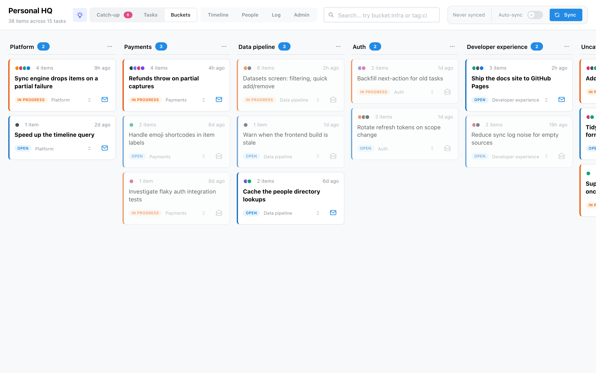

# Mention HQ

**Mention HQ** aggregates your activity across GitHub, Linear, Slack, Notion and local files —
git branches, todo files, markdown docs — and groups it into the subjects you actually work on,
so you regain context on a topic fast instead of tab-hopping across ten tools.

It runs **locally**, against your own accounts. It reads by default and only ever writes to a
source on a deliberate action you take — never as a side effect of a sync.

## The model, in three words

Everything reads as **Bucket → Task → Item**:

- an **Item** is one thing from one source — a PR, a Slack thread, a todo line, a branch;
- a **Task** is a subject you handle, and items attach to it;
- a **Bucket** is a topic column on the [board](screens/board.md) that groups tasks.

Sources emit items; the [engine proposes](concepts.md#the-engine-proposes-you-decide) which task
each belongs to; you confirm or skip in [catch-up](screens/catch-up.md). Your decisions are kept
— a sync never overrides them.

- :lucide-layout-dashboard: **[One board, every source](screens/board.md)**

    A PR, a Slack thread, a Linear issue and a local branch about the same subject sit together
    on one task, in buckets you define.

- :lucide-inbox: **[A catch-up inbox](screens/catch-up.md)**

    Everything you haven't ruled on in one place. The engine proposes where each item belongs;
    triage rules auto-skip the noise.

- :lucide-git-branch: **[Code-aware tasks](screens/tasks.md)**

    PRs carry their review status; local branches show their git-spice stack; a PR joins the
    branch it was pushed from — the whole stack reads as one card.

- :lucide-brain: **[An optional AI brain](brain.md)**

    Next actions, item→task matching and bucket suggestions — from your logged-in `claude` CLI or
    an API key. Everything works without it.

- :lucide-users: **[A people directory](screens/people.md)**

    One colleague — a Slack id, a GitHub login, an email — collapses to a single person you can
    merge and give an avatar.

- :lucide-shield-check: **[Local and private](getting-started.md)**

    Your data is a SQLite file on your machine; secrets live in the OS keychain, never the
    database or a log line.

!!! tip "Explore without touching your data"

    `task back:seed` builds a throwaway demo database populated across every source, so you can
    poke around — every screenshot in these docs is captured from it — without ever touching your
    real `hq.db`. See [Getting started](getting-started.md).
