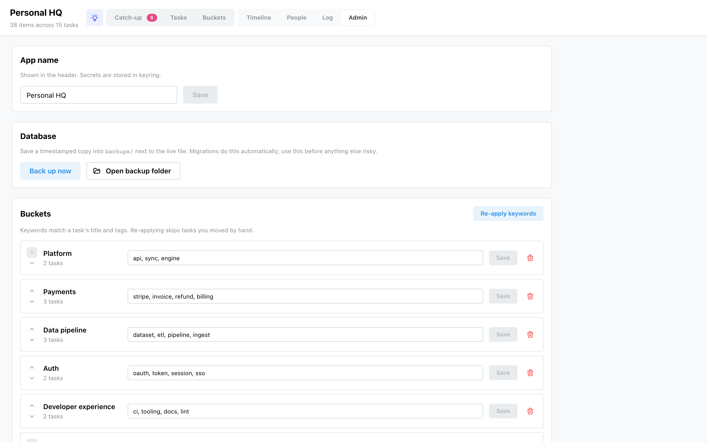

# Admin

The Admin screen is where you name the app, connect and configure [sources](../sources.md), manage
buckets, back up your data, and set up the [AI brain](../brain.md).

## App name

The name shown in the header (and, live, in the installed [PWA](../getting-started.md)'s title).
It's a normal setting — change it and Save.

## Database

- **Back up now** — writes a timestamped copy into `backups/` beside the live database (migrations
  do this automatically too).
- **Open backup folder** — reveals `backups/` in your file manager.

## Buckets

- **Re-apply keywords** — re-matches every task against bucket keywords, **skipping tasks you moved
  by hand**.
- Per bucket: reorder (up/down), edit its **keywords** (Save), or **delete** it (its tasks fall to
  Uncategorized). Uncategorized is implicit — it can't be edited, moved or deleted.
- **Create** a bucket with a name and comma-separated keywords.

## Connected sources

Add a source from the picker (you can connect the same kind more than once — a work and a personal
GitHub). Each source card gives you:

- a status badge, description and setup help, and a **rename** control;
- a **config form generated from the source's own fields** — text inputs, secret fields (shown as
  *Stored* once set, never blanked), select fields when detection offers choices, and folder
  **browse** fields;
- for OAuth sources (Notion), the exact **Redirect URI** to register and a **Connect** button;
- footer actions: **Save** (only edited fields are sent), **Detect** (auto-fill from a local CLI,
  where supported), **Test connection**, and **Remove** (deletes the credentials; items already on
  tasks stay).

See [Sources](../sources.md) for what each one brings and how to authenticate it. Secrets go to
your **OS keychain**, never the database — the API only ever returns a masked hint.

## AI

Shows whether the [brain](../brain.md) is available and which model it uses. You can store an
**API key** (or Clear it to fall back to your environment / logged-in `claude` CLI), and
**Compute next actions** to backfill a next action for every task that lacks one.
