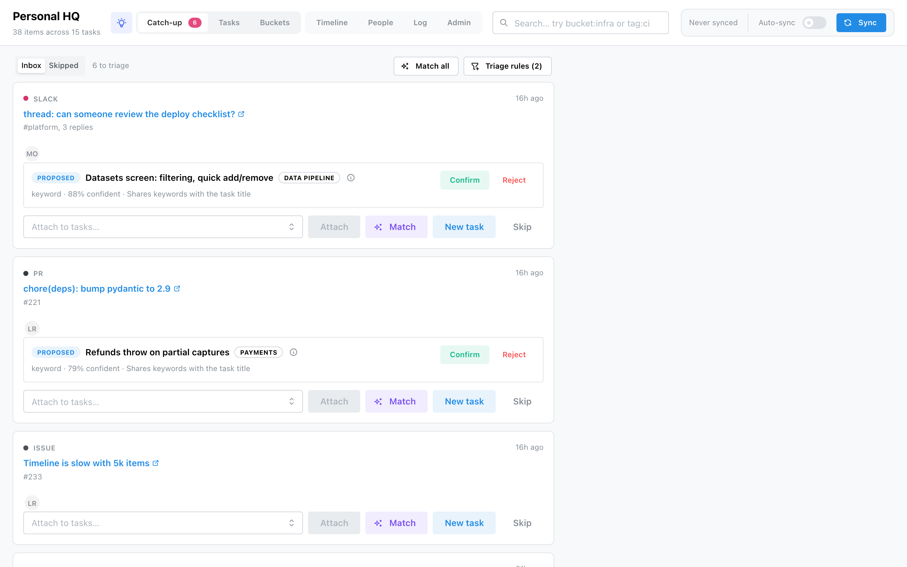

# Catch-up

Catch-up is the inbox of everything you haven't ruled on — every item a sync brought in that isn't
filed onto a task and wasn't auto-skipped. The tab carries a badge with the count.

Two tabs: **Inbox** (untriaged items, items the engine already proposed a task for leading) and
**Skipped** (with a time-window filter). The header search filters both.

## Ruling on an item

Each card shows the item and, beneath it, any **proposals** — a task the engine matched, with its
bucket, engine, confidence and reason, and an info icon that previews the task. From there:

- **Confirm** a proposal *stages* that task into the item's **attach box** — it does **not** file
  the item yet. **Reject** dismisses the proposal outright (and the rejection sticks).
- **Attach** files the item onto every task selected in the attach box.
- **Match** asks the [AI brain](../brain.md) to suggest tasks for this one item, pre-selecting them
  in the attach box for you to review.
- **New task** creates a task from the item (title prefilled, optional bucket and priority) and
  stages it — you still press Attach to file.
- **Skip** moves the item to the Skipped tab; from there **Un-skip** returns it to the inbox.

!!! info "Confirm stages, Attach files"

    Confirming a proposal only adds its task to the attach box, so you can add more tasks before
    filing. Nothing is attached until you press **Attach**.

## Match all

**Match all** kicks off a background pass that drains the whole inbox, asking the brain about each
un-matched item in batches. A **progress bar** shows how many are left with a **Stop** button;
items the engine already proposed are counted without a brain call. Requires the
[AI brain](../brain.md) to be configured.

## Triage rules

The **Triage rules** button opens the standing "skip this" filters. A rule matches an item's label
by **contains** or **starts with**, optionally scoped to certain sources (empty = every source),
and auto-skips it *before* it reaches the inbox — the app-shipped equivalent of a mail filter (a
skipped item shows `Rule: <name>` as its reason). Rules only skip; they never attach anything.

## Brain dump

The lightbulb button in the header opens **Brain dump** — a distraction-free page to type a thought
straight into an item. Left unattached it flows into this inbox; attach it to tasks as you submit
and it's filed straight onto them. A brain dump can also carry a **URL and title**, becoming a
clickable link item whose typed text is its description. Note items stay editable in place.
