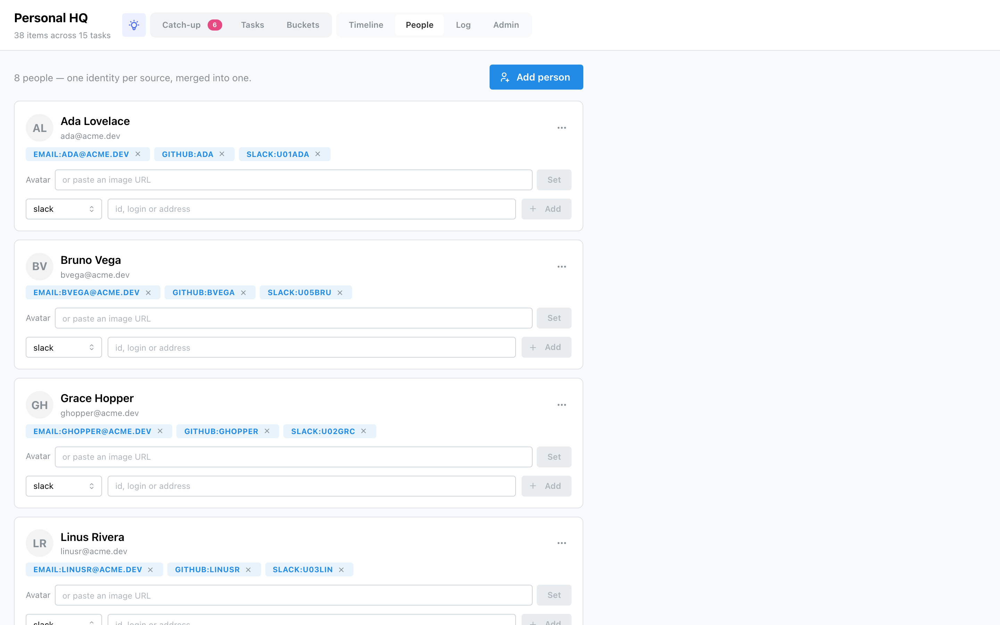

# People

Every author, assignee and mention your items name is folded into a **people directory**, so one
colleague — a Slack id, a GitHub login and an email at once — can be a single person, and a name
learned on one source answers on all of them.

## How people appear

People are **discovered on sync**: each source emits the handles it sees, and HQ records one person
per handle, carrying whatever name and avatar the source provided. So a first sync often creates
*separate* entries for the same human — one from their Slack id, one from their GitHub login. HQ
does **not** guess that two entries are the same person, because two people can share a name.
Combining them is a deliberate action you take.

## Merging is manual

Each person's **⋯ menu → Merge into…** opens a picker; choosing a target moves this person's
handles onto it and deletes this entry. That's the only way two directory entries combine — there
is no automatic merge. Once merged, the handles live under one person, so future syncs keep them
together.

## Avatars

The shown avatar is the one you chose, falling back to the first source-provided image. On a
person's card you can:

- **click an avatar swatch** — one per distinct image a source carried for them — to pick it;
- **paste an image URL** and press Set for a custom avatar;
- **Clear** a custom avatar to fall back to a source image or initials.

Source-provided avatars are filled in automatically as they're discovered, but an avatar you've set
is never overwritten.

## Add, edit, delete & handles

- **Add person** — a name and optional email, by hand.
- **Edit** (⋯ → Edit) — change the display name and email.
- **Delete** (⋯ → Delete) — removes the person and all their handles; their items are untouched.
- **Handles** — each identity shows as a `kind:value` badge with an **×** to remove it, and an
  add-a-handle row (kind: slack / github / linear / dust / email, plus the id, login or address).
  A handle is unique across the directory — it can only belong to one person.
