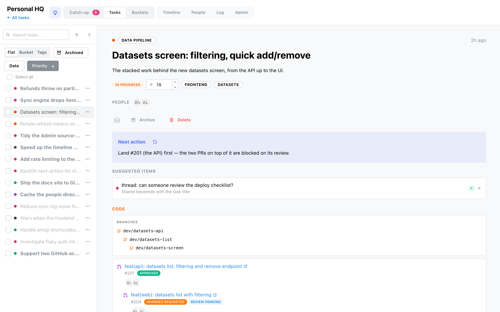

# Tasks

The **Tasks** tab is a two-pane screen: a task list on the left, the open task on the right. It's
where a subject comes together — its Slack threads, PRs, issues, branches and notes side by side.

## The task list

- **Search tasks** (focus with **⌘/Ctrl-K**), and **+** to create one.
- **Group** the list Flat, by Bucket or by Tags; **sort** by Date or Priority (click again to flip
  the direction).
- **Archived** switches the list to archived tasks.
- **Collapse** the sidebar, or drag its edge to resize (the width is remembered).
- Each row has a **⋯ menu** to Archive/Restore or Delete, and a checkbox — tick several (or
  *Select all*) to **bulk archive or delete**.

## The task

Opening a task marks it read. The header shows its **bucket** (with a **Suggest bucket** button
when it's still Uncategorized), an *Archived* badge if archived, and the age of its newest item.

**What you can edit here:**

- **Description** — click the text to edit inline; blur saves, Escape cancels.
- **Priority** — a 0–100 field; higher sorts first.
- **Read / archive / delete** — the action row. Archiving returns you to the list; deleting warns
  that the task's items return to [catch-up](catch-up.md) to be triaged again (archive instead to
  keep them filed).

Status, tags and the merged **people** strip are shown but set elsewhere — status and tags follow
the task's items on sync; people resolve through the [directory](people.md).

**[Next action](../brain.md)** (if the AI brain is configured) is a one- or two-sentence concrete
next step, precomputed so it's there on open, with a refresh button to recompute it.

**Suggested items** are the engine's proposals for this task — each with **Attach** (green +) to
file it or **Dismiss** (×) to reject it.

## The two lanes

A task's items split into two columns.

### Activity

Everything that isn't code: **Slack** leads in its own section, then Linear issues, Notion pages,
todos, notes and the rest. Each is a card linking out to its source; note items have an inline edit
pencil.

### The Code lane

PRs and local git branches, laid out like the git-spice stack comment on GitHub rather than a flat
list:

- a single **Branches** card draws every local branch as an indented git-spice stack (a
  branch that's been deleted from the repo is struck through and pilled **deleted**);
- a **git-spice stack of PRs** collapses into one card — the PRs as a tree, base to top, each with
  its number, review-status pill and reviewers;
- a **standalone PR** gets its own card.

A PR joins the local branch it was pushed from, so the whole stack — issue, branches and PRs —
reads as one coherent unit. See [Sources → GitHub / Local Git](../sources.md#github) for where the
stack and review data come from.
