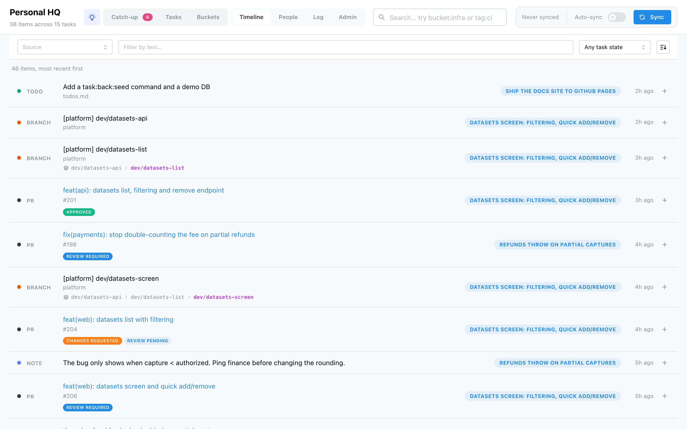

# Timeline

The Timeline is the flat, chronological feed of **every** item HQ has — filed or not, triaged or
not — newest first.

A sticky filter bar narrows it:

- **Source** — a multi-select built from the sources actually present.
- **Filter by text** — matches an item's label and context.
- **Task state** — *Any*, *On a task*, or *To triage*.
- **Sort order** — newest-first ⇄ oldest-first.

Each row shows the item with its source, and on the right either the **task badges** it's filed
under (click one to open that task) or a grey *To triage* / *Skipped* marker. The **⋯ menu** on a
row lets you **Attach it to a task** (or create a new one from it) and **Delete the item** —
deletion removes it from HQ and any task it's on, leaving the source untouched (useful for clearing
out what a since-removed source left behind).
